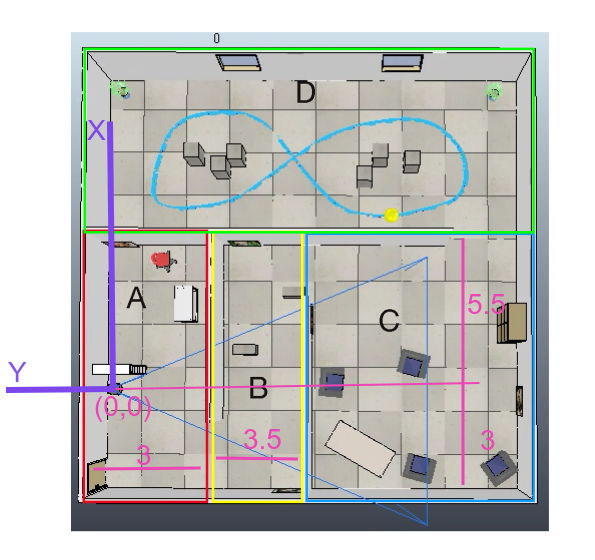
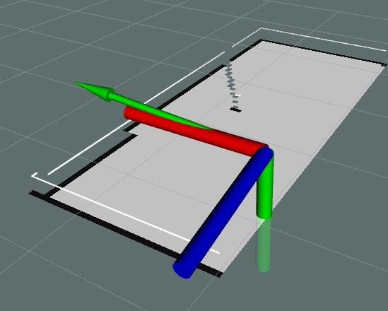

# Overview

In this project, we tried to control a robot car to finish different tasks in the simulation. We used ROS as the primary tool and used V-rep to simulate all the environment and behavior.  

The robot car with lidar and camera is located at the beginning point in a room with four areas. We need to finish several tasks including keyboard control, map formation, location judgment, face recognition, and object tracking.

We got familiar with the basic ROS concept and implementation like package, nodes, topics, subscribers, and publishers.  We also studied how to use the simulation tools to perform a robot control task. Besides, we implemented the control method, SLAM, image processing that we learned in this course before.

# Environment setup

Test environment:

- Ubuntu 20.04
- ROS-noetic
- [V-REP PRO EDU 3.62 Ubuntu 18.04](https://coppeliarobotics.com/files/V-REP_PRO_EDU_V3_6_2_Ubuntu18_04.tar.xz)
- OpenCV version 4.2.0

External pacakge:

- [hector-mapping][]

Setup

1. run `roscore`
2. launch the simulation `cd <V-REP-dir>` , then `./vrep.sh <location of environment file>`, then start the simulation
3. `roslaunch final_3210 main.launch`. It will pop out 4 windows
   - rviz: for rviz visualization
   - teleop: for keyboard teleop control
   - location: print out location and judge the room label
   - Capture - Face detection: image get from the camera. It will mark the recognized face.

# Design and Implement

## Work distribution

**XU Jinyun:** keyboard control(task1), location judgment(task3), visual servo(task5), and report writing.

**XU Xinyuan:** map building(task2), face recognition(task4), launch file(task6), demo video making, and report writing.

## 1 keyboard control

**by Jinyun**

In the beginning, we wrote a simple keyboard control. You can add 0.5 to linear speed by pressing `UP`, reduce 0.5 by pressing `DOWN`. To control the direction, the `LEFT` or `RIGHT` button to add/subtract angular speed by 1. But in the practice experiment, it works no very well. It can control the robot, but with noise, you need to adjust the direction manual frequently. Also, the simple keyboard listener can only listen to one key at one time, as the result, the control was not efficient enough.

So we take a reference from the official ROS keyboard control:  `teleop_twist_keyboard.py` from package `teleop_twist_keyboard`. Modified a bit to switch on and off the [visual servo](#5-visual-servo) function. Press `a` to enable, `s` to stop.

## 2 build map with laser

**by Jinyun & Xinyuan** 

## 3 judge location

**by Jinyun**

We used the existing SLAM package to achieve the location judgment. From the last task, we mapped the robot to `base_link` and the environment to `map`. They both got independent frame. We have tried to use `tf2` to calculate the movement between the robot and the environment and then find the local position. But the SLAM algorithm would form frames points in different directions every time, it became very difficult to identify which area the robot is. 

Instead, we directly use the position information published by `hector-SLAM` package. After several experiments, we could find the size of the whole environment and each area and the coordinate axis direction which are showed in the following picture. After that, we can easily tell the room index by the position coordinate.

## 4 image recognition and localization

**by  Xinyuan**

1. Detection 

   We use OpenCV [Haar Cascade][] method for face detection. The data pre-trained is downloaded from [here][Haar Cascade dataset]. We chose the file `haarcascade_frontalface_default.xml`.

   The detection is based on gray-scale, and able to detect multiple faces, we choose only the largest one and resize it to a scale of 50 x 50. The gray-scale resized region of interest (ROI) is then passed to the recognition model, because the recognition model also work on only the gray-scale image.

2. Recognition

   We use OpenCV [Eigenfaces][] method for face recognition.

   The Eigenfaces method use PCA to recognize different faces. We need to first prepare a dataset to train the model. Before the first time we run the recognition, we collected 16 detection results for each image and save it in `imgs` dir. These results are all 50 x 50 gray-scale images output by the detection model.

   When the program start, the Eigenfaces model will load all the training dataset and train itself. Then we can directly use it to recognize the label of incoming images. 

3. Localization
   Let the center of the ROI be $P_c =(x_c, y_c)$. As the size of image is 512 x 512, the camera has Perspective angle $\pi\over 4$, the relative angle to the left-up corner is
   $$\theta_x = {\pi\over 4}*{x_c\over 512} - {\pi\over 8}\\\theta_y = {\pi\over 4}*{y_c\over 512} - {\pi\over 8}$$

   where positive means from left to right and up to down.

   With $\theta_x$, we can get the ground distance between the robot and the image by looking up the corresponding laser data. Let the distance be $d$. the length form the camera to $P_c$ is $l = {d\over cos(\theta_y)}$

   In a coordinate where X is front, Y is left, and Z is up, The rotation $q$ to move the $P_c$ to the center in Row-Pitch-Yaw is $(0,\theta_y,-\theta_x)$. However, the coordinate of `camera_link` is not the case. The X(red) axis is correct, but the other two axises are rotated -100 degree relative to X axis. Let this rotation be $q_n$, Row-Pitch-Yaw form $({-100\pi\over 180}, 0, 0)$. So the final rotation for `camera_link` is $q_n^{-1}*q*q_n$. The green arrow stands for the X-axis of the new frame, where $P_c$ is located at $(l,0,0)$

   

## 5 visual servo

**by Jinyun**

In the visual servo part, the robot will automatically track the yellow ball without human control. You can press `a` to start and `s` to stop this function.

1. Image processing
   
   We obtained the camera image from the robot and turn it into `mat` type for `OpenCV` using [cv_bridge]. For better performance, we extract all yellow elements and turn it into a bit form image only black and white using [COLOR_BGR2HSV].  Then we simply use [HoughCircles] to detect all circles and found their centers. With a good parameter setting most time it will only detect one circle.
2. Basic control	
   
	In the control part, we used the radius of the detected circle as the measurement of distance. When the radius is less than a certain range, which means the distance between the robot and the ball is far enough, the robot will start moving. To get the moving direction, we took the center point of the circle as the reference. If the vertical position is on the left the robot will turn right a little bit, verse vice. Remember that the image from the camera is flipped, so the direction is opposite.
3. Improvment 
   
	Because of the blocks and big turning, the camera may sometimes lose the ball. And the robot will be stuck in the turning corner. This always happened at the intersection of turning and straight line. To avoid this situation, we added an extra condition. When the camera lost the ball, the robot will keep the last movement command for a while so that it can catch the ball again.

## 6 launch file

**by Xinyuan**

`main.launch` includes 3 files, `teleop_and_tracking.launch`,`slam.launch`, and `face.launch`.

`teleop_and_tracking.launch` launch `teleop_twist_keyboard.py` and the visual servo node `track`.

`slam.launch` publish a `static_tf_transform` from `odom` to `base_link` and launch `hector-mapping`. `hector-mapping` will publish the transform from `map` to `odom`.

`face.launch` specify the dataset location and launch the node `face`.

## limitation

1. For keyboard control, the robot itself will produce some noise. made the control not perfect. For future studies, we may apply some filter for better performance.
2. In visual servo, we only use P control, for better performance we can apply more sophisticated PID control.
3. In location judgment, we can also use SLAM to get the whole environment information including size.

# Conclusion

# References

[hector-mapping]: https://github.com/tu-darmstadt-ros-pkg/hector_slam
[Haar Cascade]: https://docs.opencv.org/3.4/db/d28/tutorial_cascade_classifier.html
[Haar Cascade dataset]: https://github.com/opencv/opencv/tree/3.4/data
[Eigenfaces]: https://docs.opencv.org/master/da/d60/tutorial_face_main.html
[cv_bridge]: http://wiki.ros.org/cv_bridge/Tutorials/UsingCvBridgeToConvertBetweenROSImagesAndOpenCVImages
[HoughCircles]: https://docs.opencv.org/3.4/d4/d70/tutorial_hough_circle.html
[COLOR_BGR2HSV]: https://docs.opencv.org/3.4/d8/d01/group__imgproc__color__conversions.html

